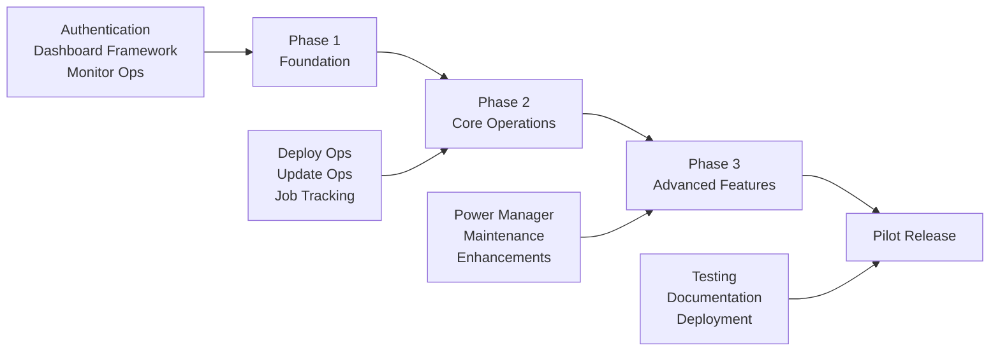
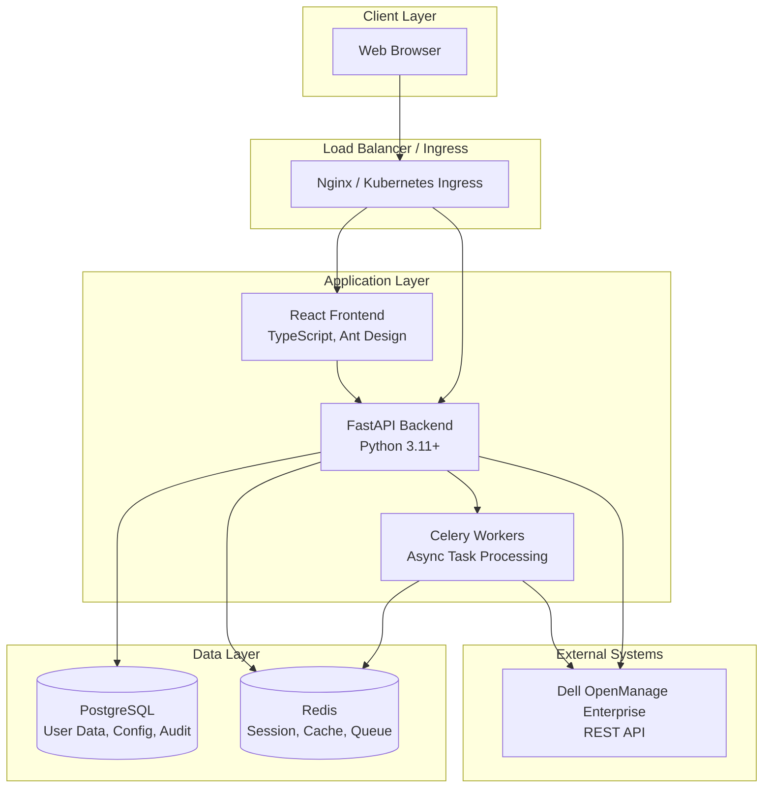
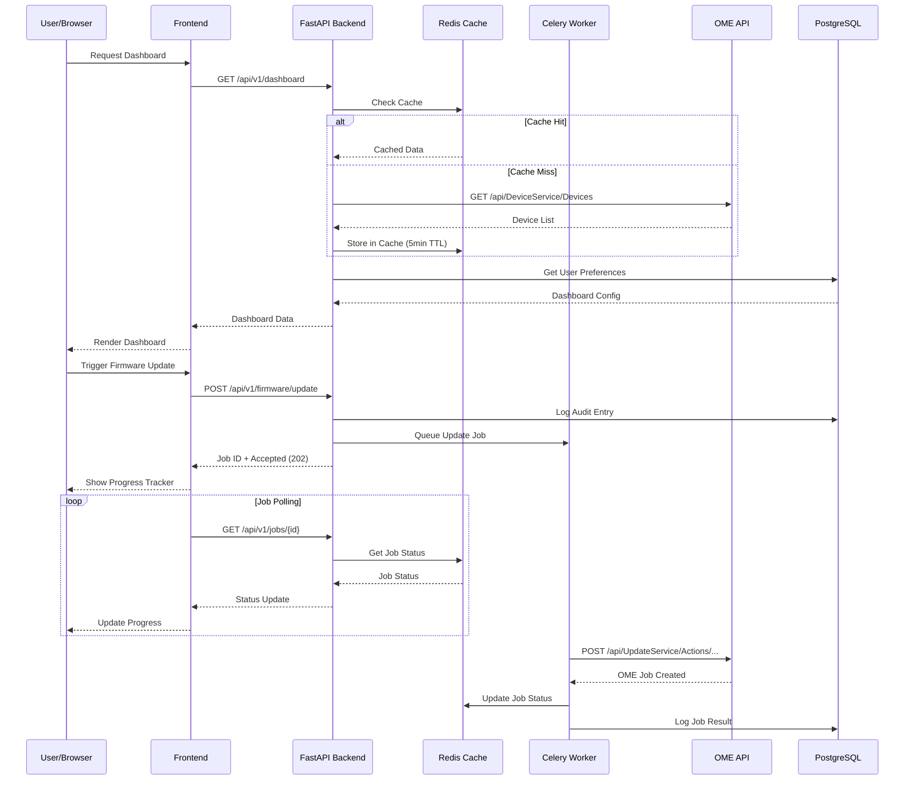
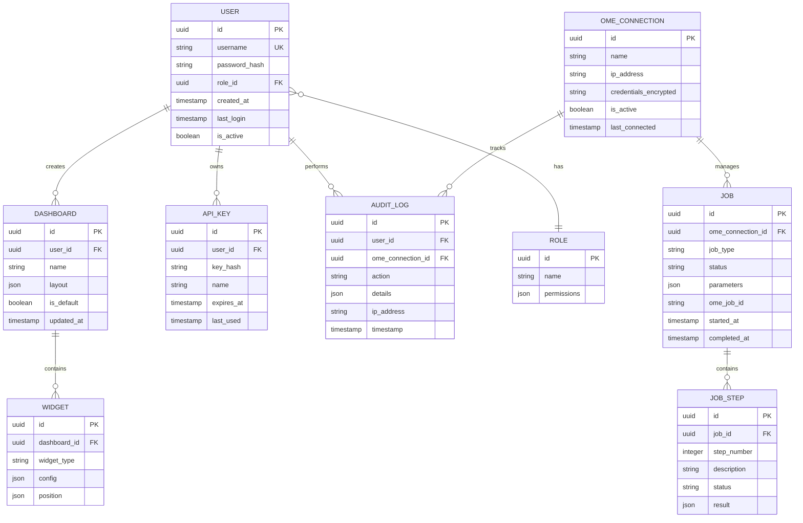
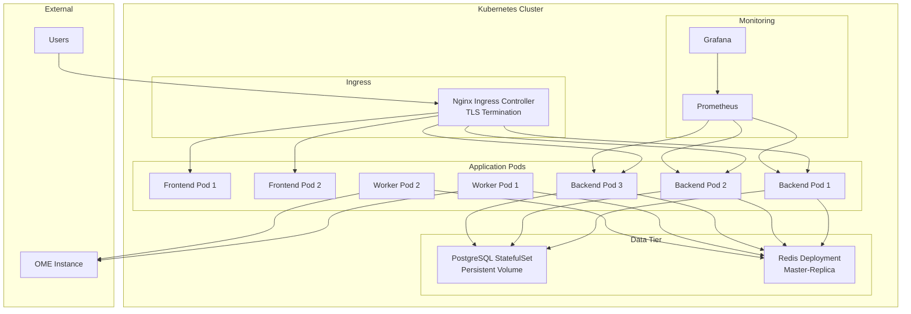
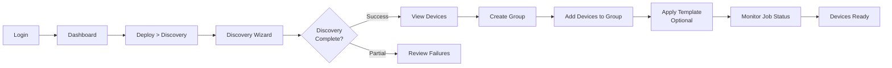
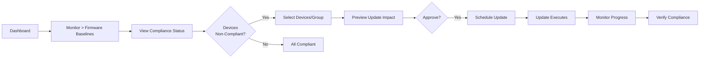
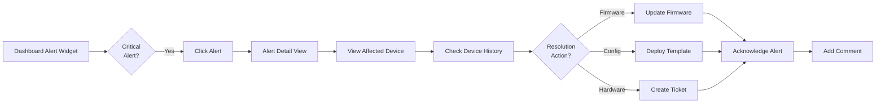

# OpenManage Enterprise Web Console
## Product Requirements Document v1.0

---

## Table of Contents

1. [Executive Summary](#1-executive-summary)
2. [Market & User Analysis](#2-market--user-analysis)
3. [Product Strategy](#3-product-strategy)
4. [Functional Requirements](#4-functional-requirements)
5. [Priority Enhancements](#5-priority-enhancements)
6. [Non-Functional Requirements](#6-non-functional-requirements)
7. [Technical Architecture](#7-technical-architecture)
8. [User Experience](#8-user-experience)
9. [Success Metrics](#9-success-metrics)
10. [Timeline & Milestones](#10-timeline--milestones)
11. [Risks & Mitigations](#11-risks--mitigations)

---

## 1. Executive Summary

### Vision Statement

**OpenManage Enterprise Web Console** is a modern, enterprise-grade web management platform that provides a streamlined, customizable interface for managing Dell infrastructure through the OpenManage Enterprise API.

### Product Overview

This web-based management console will provide enterprise IT administrators with a powerful, intuitive interface to perform all Dell OpenManage Enterprise operations including device discovery, firmware management, monitoring, and power optimization - all from a customizable dashboard-driven experience.

### Strategic Value Proposition

#### 🎯 Customizable Experience
Unlike the native OME console, provides drag-and-drop dashboard customization tailored to organizational workflows and device types.

#### 🚀 Modern Architecture
Built with modern enterprise stack (React, FastAPI, containerized) for performance, scalability, and easy deployment.

#### 🔧 Streamlined Operations
Focus on most-used operations with intelligent bulk actions, comparison views, and scheduled operations.

#### 📊 Enhanced Insights
Advanced reporting, trend analysis, and custom report builder beyond standard OME capabilities.

### Success Criteria

- ✅ **Pilot Completion:** Fully functional MVP with all 6 operation categories in 3 months
- ✅ **User Adoption:** 80% of pilot users prefer this console for daily operations
- ✅ **Performance:** Sub-second response for dashboard loads, real-time job updates
- ✅ **Reliability:** 99.9% uptime during pilot period
- ✅ **Customization:** Users create average 3+ custom dashboards per role

### Target Market

**Primary:** Enterprise IT teams (500-10,000+ Dell servers) requiring streamlined Dell infrastructure management

**Secondary:** Managed service providers (MSPs) managing multiple client OME instances

---

## 2. Market & User Analysis

### 2.1 Target Users

| Persona | Role | Primary Goals | Pain Points |
|---------|------|---------------|-------------|
| **IT Administrator** | Infrastructure Manager | Manage device lifecycle, ensure compliance, monitor health | Repetitive tasks, multiple tools, complex workflows |
| **Operations Engineer** | Day-to-day Management | Firmware updates, device discovery, troubleshooting | Time-consuming bulk operations, unclear job status |
| **Power Manager** | Energy Optimization | Monitor consumption, apply policies, reduce costs | Limited visibility into power trends, manual policy application |
| **Auditor/Viewer** | Compliance & Reporting | Generate reports, verify compliance, track changes | Inflexible reports, no custom views, limited export options |

### 2.2 Current Pain Points

#### Native OME Console Limitations
- Fixed dashboard layouts - not customizable per user/role
- Complex navigation for common tasks
- Limited bulk operation capabilities
- No side-by-side comparison views
- Inflexible reporting options
- No scheduled operations (maintenance windows)

#### CLI/Script Approach Limitations
- Steep learning curve for non-developers
- No visual feedback or progress tracking
- Error-prone manual input
- Difficult to audit who did what
- No centralized history or rollback
- Requires maintenance of script library

### 2.3 Competitive Landscape

| Solution | Strengths | Weaknesses | Our Advantage |
|----------|-----------|------------|---------------|
| **Native OME Console** | Official, comprehensive, integrated | Not customizable, complex UI, enterprise bloat | Streamlined, customizable, modern UX |
| **CLI Scripts** | Powerful, automatable, flexible | No UI, requires technical expertise | Visual interface with CLI power |
| **Third-party Tools** | Multi-vendor support | Expensive, generic, not Dell-optimized | Dell-specific, cost-effective, purpose-built |

---

## 3. Product Strategy

### MVP Scope (3-Month Pilot)

**Core Capabilities:**
- ✅ Single OME instance connectivity with secure authentication
- ✅ Customizable dashboard with drag-and-drop widgets
- ✅ All 6 operation categories (47 operations total)
- ✅ Real-time job tracking and notifications
- ✅ Multi-user support with role-based access
- ✅ Containerized deployment (Docker/Kubernetes)
- ✅ Export capabilities (CSV, JSON, PDF reports)

### Phased Feature Rollout

### Out of Scope for MVP

- Multi-OME instance aggregation (single instance focus)
- Mobile native apps (responsive web only)
- Offline mode
- Integration with non-Dell systems
- AI/ML predictive analytics
- Custom plugin development framework

### Future Roadmap (Post-Pilot)

| Quarter | Features | Business Value |
|---------|----------|----------------|
| **Q2 2025** | Multi-OME instance support, SSO/LDAP, Advanced RBAC | Enterprise scalability, security compliance |
| **Q3 2025** | Workflow automation builder, AI-powered recommendations | Operational efficiency, proactive management |
| **Q4 2025** | Mobile apps, offline mode, plugin marketplace | Mobility, extensibility, ecosystem growth |

---

## 4. Functional Requirements

### 4.1 Customizable Dashboard Module

**Priority:** HIGH | **Phase:** 1

#### Overview
The central hub of the application, providing at-a-glance visibility into OME infrastructure health, status, and operations.

#### Widget Library

| Widget | Description | Data Source | Customization |
|--------|-------------|-------------|---------------|
| **Device Health Summary** | Total devices by status (healthy/warning/critical) | GET /DeviceService/Devices | Filter by device type, group |
| **Active Alerts** | Recent alerts with severity breakdown | GET /AlertService/Alerts | Filter by severity, category, time range |
| **Job Queue Status** | Running/pending/completed jobs | GET /JobService/Jobs | Show/hide job types |
| **Firmware Compliance** | Baseline compliance gauge | GET /UpdateService/Baselines | Select specific baseline |
| **Power Consumption Trend** | Real-time and historical power usage | Power Manager APIs | Time range, device/group selection |
| **Top Device Groups** | Most used groups with device counts | GET /GroupService/Groups | Sort by size/name/recent |
| **Warranty Status** | Devices with expiring warranties | GET /WarrantyService | Warning threshold (30/60/90 days) |
| **Quick Actions** | One-click access to common operations | N/A | User-defined action shortcuts |

#### Dashboard Customization Features

- **Drag-and-drop:** Reposition widgets via React Grid Layout
- **Resize:** Widgets support small/medium/large sizes
- **Add/Remove:** Widget gallery to add from library
- **Save/Load:** Multiple named dashboards per user
- **Share:** Export dashboard config to share with team
- **Templates:** Pre-built dashboards (Server Admin, Power Manager, Security Auditor)
- **Tabs:** Multiple dashboard tabs (e.g., Overview, Servers, Storage, Power)
- **Auto-refresh:** Configurable refresh intervals (10s/30s/1m/5m/off)

### 4.2 Deploy Operations (13 Operations)

**Priority:** HIGH | **Phase:** 2

#### 4.2.1 Device Discovery

**Operations:** `invoke_discover_device`, `edit_discovery_job`

**Features:**
- Step-by-step discovery wizard with validation
- Support for multiple discovery protocols (SNMP, WS-Man, Redfish, SSH)
- Bulk IP range/subnet entry with CIDR notation
- CSV import for large device lists
- Credential management (save/reuse discovery credentials)
- Schedule recurring discovery jobs
- Real-time progress tracking with device-by-device status
- Failed device retry with detailed error messages

#### 4.2.2 Group Management

**Operations:** `new_static_group`, `new_mcm_group`, `add_device_to_static_group`, `add_members_to_mcm_group`, `invoke_manage_query_groups`

**Features:**
- Tree view of group hierarchy with drag-and-drop organization
- Static group creation with multi-select device assignment
- Dynamic/query groups with visual query builder
- MCM (Multi-Chassis Management) group setup wizard
- Bulk device import from CSV or discovery jobs
- Nested group support with inheritance visualization
- Group comparison view (side-by-side device lists)
- Group templates for common organizational patterns

#### 4.2.3 Template Management

**Operations:** `new_template`, `deploy_template`

**Features:**
- Template creation wizard with reference device selection
- Component-level template capture (iDRAC, BIOS, NIC, Lifecycle Controller)
- Template library with search, filter, tags
- Template comparison tool (diff view between templates)
- Deployment preview with impact analysis
- Identity pool integration for NIC/iDRAC settings
- Staged deployment with rollback capability
- Schedule deployments for maintenance windows
- Deployment history and audit log per template

#### 4.2.4 Network Configuration

**Operations:** `new_network`, `copy_vlans`, `get_ome_vlans`

**Features:**
- Network topology visualization
- VLAN creation with validation
- Bulk VLAN copy between OME instances
- VLAN assignment to device groups
- Network profile templates
- Conflict detection (overlapping VLANs)

#### 4.2.5 User Management

**Operations:** `new_ome_user`, `get_ome_users`

**Features:**
- User creation with role assignment
- User list with active session tracking
- Password policy enforcement
- User activity audit log

#### 4.2.6 Power State Control

**Operations:** `set_power_state`

**Features:**
- Bulk power operations (on/off/cycle/graceful shutdown)
- Device power state visualization in grid
- Schedule power operations
- Safety confirmations with impact preview

### 4.3 Update Operations (3 Operations)

**Priority:** HIGH | **Phase:** 2

#### 4.3.1 Firmware Management

**Operations:** `update_firmware_using_catalog`, `update_installed_firmware_with_dup`, `get_firmware_baselines`

**Features:**
- Firmware baseline dashboard with compliance visualization
- Catalog browser with Dell repository sync status
- Component-level update selection (BIOS, iDRAC, NIC, RAID, etc.)
- Direct DUP file upload for offline updates
- Update impact analysis (reboot required, dependencies, conflicts)
- Staged rollout (pilot group → production)
- Schedule updates for maintenance windows
- Update history per device with rollback tracking
- Compliance reporting (baseline vs. current versions)
- Bulk update operations with progress tracking
- Automatic retry on failures with configurable attempts

#### 4.3.2 Inventory Refresh

**Operations:** `invoke_refresh_inventory`

**Features:**
- Manual inventory refresh for selected devices/groups
- Schedule recurring inventory refresh jobs
- Last refresh timestamp display in device list
- Change tracking (highlight inventory differences)

### 4.4 Monitor Operations (12 Operations)

**Priority:** HIGH | **Phase:** 1

#### 4.4.1 Device Inventory

**Operations:** `get_device_list`, `get_device_inventory`, `get_chassis_inventory`

**Features:**
- Responsive data grid with sorting, filtering, pagination
- Multi-level filtering (device type, status, group, model, location)
- Saved filter presets
- Column customization (show/hide, reorder)
- Device detail drill-down (hardware specs, firmware versions, alerts)
- Chassis view with slot visualization for blades
- Export to CSV/JSON/Excel
- Bulk selection for operations
- Global search with autocomplete
- Device comparison view (side-by-side specs)

#### 4.4.2 Alert Management

**Operations:** `get_alerts`

**Features:**
- Alert dashboard with severity breakdown (critical/warning/info)
- Real-time alert stream with notifications
- Advanced filtering (severity, category, device, time range, status)
- Alert detail view with recommended actions
- Alert acknowledgment and comments
- Alert history and trends
- Custom alert rules and thresholds
- Email/webhook notifications on critical alerts
- Alert suppression during maintenance

#### 4.4.3 Reporting

**Operations:** `get_report_list`, `invoke_report_execution`, `get_audit_logs`

**Features:**
- Report library with pre-built and custom reports
- Report execution with parameter input
- Schedule recurring reports (daily/weekly/monthly)
- Report output formats (CSV, JSON, PDF, Excel)
- Report email distribution lists
- Audit log viewer with filtering
- Custom report builder with drag-and-drop fields
- Report templates sharing across team

#### 4.4.4 Additional Monitoring

**Operations:** `get_group_by_device`, `get_group_details`, `get_group_details_by_filter`, `get_group_list`, `get_identitypool_usage`, `get_warranty_information`

**Features:**
- Group membership visualization
- Identity pool usage tracking with threshold alerts
- Warranty expiration dashboard with notifications
- Service tag lookup and warranty auto-refresh

### 4.5 Maintenance Operations (2 Operations)

**Priority:** MEDIUM | **Phase:** 3

**Operations:** `invoke_retire_lead`, `set_scale_vlan_profile`

**Features:**
- MCM lead retirement wizard with backup lead selection
- Failover simulation and impact analysis
- Scale VLAN profile management interface
- Maintenance mode toggle for devices/groups

### 4.6 Power Manager Module (15 Operations)

**Priority:** MEDIUM | **Phase:** 3

#### Overview
Comprehensive power monitoring, optimization, and policy management for energy-efficient operations.

#### 4.6.1 Power Monitoring

**Operations:** `get_power_manager_device_metrics`, `get_power_manager_group_metrics`, `get_power_manager_monitoring_list`, `get_power_manager_top_energy_consumers`, `get_power_manager_top_offenders`

**Features:**
- Real-time power consumption dashboard
- Historical power trends (hourly/daily/weekly/monthly)
- Device-level and group-level metrics
- Top energy consumers ranking (devices/chassis/groups)
- Power/temperature threshold violations tracking
- Power efficiency scoring
- Cost estimation based on kWh rates
- Comparative analysis (before/after policy application)

#### 4.6.2 Policy Management

**Operations:** `get_power_manager_policies`, `get_set_power_manager_setting`

**Features:**
- Power policy library with templates
- Policy creation wizard (static/dynamic caps, thermal management)
- Bulk policy application to groups
- Policy effectiveness tracking
- Schedule policy changes (business hours vs. off-hours)
- Power Manager global settings configuration

#### 4.6.3 Capability & Alerts

**Operations:** `find_non_pmp_capable_devices`, `find_non_power_policy_capable_devices`, `get_power_manager_capable_devices`, `get_power_manager_alerts`

**Features:**
- Device capability matrix (PMP support, policy support)
- Capability gap analysis for fleet upgrades
- Power-specific alert stream
- Alert correlation with policy violations

#### 4.6.4 Reporting & Physical Groups

**Operations:** `get_power_manager_epr`, `get_power_manager_reports`, `invoke_refresh_power_manager_inventory`, `new_power_manager_physical_group`

**Features:**
- EPR (Emergency Power Reduction) configuration and testing
- Power Manager specific reports
- Physical group creation (rack/row/data center organization)
- Power inventory refresh for latest metrics

> **Note:** Power Manager features require Power Manager plugin v1.2+ installed on OME.

---

## 5. Priority Enhancements

### 5.1 Comparison View Engine

**Priority:** HIGH

**Features:**
- **Device Comparison:** Side-by-side hardware specs, firmware versions, configurations
- **Template Comparison:** Diff view showing configuration differences between templates
- **Baseline Comparison:** Compare firmware baselines for upgrade planning
- **Group Comparison:** Device membership, policies, compliance status
- **Visual Diff:** Color-coded highlighting of differences
- **Export:** Comparison reports in PDF/Excel

### 5.2 Bulk Operations Framework

**Priority:** HIGH

**Features:**
- **Multi-select UI:** Checkbox selection with select all/none/filtered
- **Preview Mode:** Show impact before applying (devices affected, settings changed)
- **Validation:** Pre-flight checks for compatibility/conflicts
- **Staged Execution:** Pilot group → review → full rollout
- **Progress Tracking:** Real-time status per device with success/failure breakdown
- **Automatic Retry:** Configurable retry logic for transient failures
- **Rollback Support:** Undo operations where possible
- **CSV Import:** Bulk operations from spreadsheet

**Supported Bulk Operations:**

| Operation | Description | Impact Analysis |
|-----------|-------------|-----------------|
| Firmware Update | Update multiple devices to baseline | Reboot required, estimated downtime, dependencies |
| Group Assignment | Add/remove devices to/from groups | Policy inheritance changes |
| Template Deployment | Apply template to multiple devices | Configuration changes, reboot requirements |
| Power Policy | Apply power policy to device group | Power cap changes, thermal impact |
| Inventory Refresh | Refresh inventory for selected devices | Device load, network impact |

### 5.3 Scheduled Operations

**Priority:** HIGH

**Features:**
- **Maintenance Windows:** Define recurring maintenance schedules
- **Operation Scheduler:** Schedule any operation for future execution
- **Cron Expression Support:** Flexible scheduling (daily at 2 AM, first Sunday of month, etc.)
- **Approval Workflow:** Require manager approval for critical operations
- **Notifications:** Email/webhook alerts before/after scheduled operations
- **Schedule Calendar View:** Visual calendar of all scheduled operations
- **Conflict Detection:** Prevent overlapping operations on same devices
- **Pre-execution Checks:** Validate conditions before execution (device online, no alerts)

### 5.4 Custom Report Builder

**Priority:** MEDIUM

**Features:**
- **Drag-and-drop Interface:** Select data sources, fields, groupings
- **Visual Query Builder:** No-code filtering and aggregation
- **Multi-source Reports:** Combine device, alert, job, power data
- **Calculated Fields:** Custom formulas (e.g., power cost = kWh × rate)
- **Visualizations:** Charts, gauges, heatmaps embedded in reports
- **Parameterized Reports:** User inputs at runtime (date range, device group)
- **Report Scheduling:** Auto-generate and distribute reports
- **Template Library:** Save and share report templates
- **Export Formats:** PDF, Excel, CSV, JSON

### 5.5 Webhook & Integration Framework

**Priority:** MEDIUM

**Features:**
- **Webhook Configuration:** Register URLs for event notifications
- **Event Types:** Alert raised, job completed, device discovered, firmware updated, etc.
- **Filtering:** Only trigger webhooks for specific conditions (critical alerts, failed jobs)
- **Payload Customization:** Template webhook payload format
- **Retry Logic:** Automatic retry on webhook delivery failure
- **Pre-built Integrations:**
  - Slack notifications
  - Microsoft Teams messages
  - Email via SMTP
  - PagerDuty incidents
  - ServiceNow tickets
- **Webhook Testing:** Test webhooks with sample payloads
- **Delivery Logs:** Track webhook delivery status and errors

### 5.6 API-First Design

**Priority:** HIGH

**Features:**
- **Full REST API:** Every UI operation available via API
- **OpenAPI/Swagger Docs:** Auto-generated API documentation
- **API Key Management:** Generate/revoke API keys for automation
- **Rate Limiting:** Protect backend from abuse
- **Versioning:** API version support (v1, v2) for backward compatibility
- **SDKs:** Python and PowerShell SDK libraries
- **Interactive API Explorer:** Test API calls from browser

### 5.7 Advanced Search & Filtering

**Priority:** MEDIUM

**Features:**
- **Global Search:** Search across devices, groups, templates, alerts, jobs
- **Autocomplete:** Smart suggestions as you type
- **Saved Searches:** Save complex filter combinations
- **Advanced Query Language:** Text-based query syntax for power users
- **Search History:** Quick access to recent searches
- **Search Results Ranking:** Most relevant results first
- **Faceted Search:** Drill down by categories (device type, status, location)

---

## 6. Non-Functional Requirements

### 6.1 Performance

| Metric | Target | Measurement |
|--------|--------|-------------|
| Dashboard Load Time | < 1 second | Time to interactive after login |
| Device List Load (1000 devices) | < 2 seconds | Initial page load with pagination |
| Search Results | < 500ms | Return autocomplete suggestions |
| API Response Time (p95) | < 200ms | Backend API excluding OME calls |
| Job Status Updates | Every 5 seconds | Real-time polling frequency |
| Concurrent Users | 100+ simultaneous | No degradation in performance |

### 6.2 Security

#### Authentication & Authorization
- **Authentication:** Username/password with bcrypt hashing (10 rounds minimum)
- **Session Management:** JWT tokens with 8-hour expiration, refresh token support
- **Password Policy:** Minimum 12 characters, complexity requirements, rotation every 90 days
- **Role-Based Access Control (RBAC):**
  - **Viewer:** Read-only access to all modules
  - **Operator:** Execute operations, cannot modify users/policies
  - **Administrator:** Full access including user management
- **API Key Authentication:** Alternative to username/password for automation
- **Session Timeout:** 30 minutes inactivity, 8 hours absolute
- **Multi-Factor Authentication (MFA):** TOTP-based (Google Authenticator, Authy) - Post-MVP

#### Data Protection
- **Encryption in Transit:** TLS 1.2+ only, strong cipher suites
- **Encryption at Rest:** OME credentials encrypted with AES-256
- **Secret Management:** OME passwords never logged, masked in UI
- **Input Validation:** All user inputs sanitized to prevent injection attacks
- **CORS Policy:** Strict origin checking
- **XSS Protection:** Content Security Policy headers
- **SQL Injection:** Parameterized queries via SQLAlchemy ORM

#### Audit & Compliance
- **Audit Logging:** All operations logged (who, what, when, result)
- **Audit Retention:** 1 year minimum, configurable
- **Tamper-proof Logs:** Append-only logging to prevent modification
- **Compliance Reports:** Generate audit trails for compliance requirements
- **Change Tracking:** All configuration changes tracked with diff

### 6.3 Reliability

- **Uptime SLA:** 99.9% availability during pilot (8.76 hours downtime/year)
- **Error Handling:** Graceful degradation on OME API failures
- **Retry Logic:** Automatic retry with exponential backoff for transient errors
- **Circuit Breaker:** Prevent cascade failures from OME downtime
- **Health Checks:** /health and /ready endpoints for monitoring
- **Connection Pooling:** Reuse OME API connections efficiently
- **Timeout Management:** Reasonable timeouts to prevent hanging requests
- **Job Recovery:** Resume interrupted jobs after restart

### 6.4 Scalability

- **Horizontal Scaling:** Stateless backend supports multiple instances
- **Database Connection Pooling:** Efficient PostgreSQL connection reuse
- **Redis Caching:** Cache frequent OME API calls (device list, groups)
- **Pagination:** All large datasets paginated (100 items per page default)
- **Async Processing:** Long-running operations via Celery queues
- **CDN-Ready:** Static assets optimized for CDN delivery
- **Database Indexing:** Proper indexes on frequently queried columns

### 6.5 Maintainability

- **Code Quality:** 80%+ test coverage, linting enforced
- **Logging:** Structured JSON logs with correlation IDs
- **Monitoring:** Prometheus metrics for all key operations
- **Documentation:** API docs (OpenAPI), deployment guide, user manual
- **Versioning:** Semantic versioning (MAJOR.MINOR.PATCH)
- **Dependency Management:** Lock files for reproducible builds
- **Database Migrations:** Alembic for schema version control
- **Configuration Management:** Environment-based config (dev/staging/prod)

### 6.6 Usability

- **Responsive Design:** Support desktop (1920x1080+), tablet (1024x768+), mobile (375x667+)
- **Browser Support:** Latest 2 versions of Chrome, Firefox, Safari, Edge
- **Accessibility:** WCAG 2.1 AA compliance target
- **Loading States:** Skeleton screens, progress indicators for all async operations
- **Error Messages:** User-friendly error messages with suggested actions
- **Help System:** Contextual help tooltips, inline documentation
- **Keyboard Navigation:** Full keyboard support for power users
- **Dark Mode:** Optional dark theme for reduced eye strain

### 6.7 Deployment

- **Container Packaging:** Docker images for frontend, backend, workers
- **Orchestration:** Kubernetes manifests (Deployment, Service, Ingress, ConfigMap)
- **Configuration:** Environment variables, ConfigMaps, Secrets
- **Persistence:** PostgreSQL StatefulSet, Redis for cache
- **Backup:** Automated daily database backups with 30-day retention
- **Monitoring Stack:** Prometheus + Grafana dashboards
- **Log Aggregation:** ELK stack compatible (Elasticsearch, Logstash, Kibana)
- **CI/CD Pipeline:** Automated testing, building, and deployment

---

## 7. Technical Architecture

### 7.1 System Architecture Overview

### 7.2 Technology Stack

#### Frontend
| Component | Technology |
|-----------|-----------|
| **Framework** | React 18 |
| **Language** | TypeScript 5.x |
| **UI Library** | Ant Design 5.x |
| **State Management** | Redux Toolkit |
| **API Client** | React Query (TanStack Query) |
| **Routing** | React Router v6 |
| **Charts** | Recharts / Chart.js |
| **Dashboard Layout** | React Grid Layout |
| **Build Tool** | Vite |
| **Testing** | Vitest, React Testing Library |

#### Backend
| Component | Technology |
|-----------|-----------|
| **Framework** | FastAPI 0.100+ |
| **Language** | Python 3.11+ |
| **ORM** | SQLAlchemy 2.x |
| **Migration** | Alembic |
| **Validation** | Pydantic v2 |
| **Task Queue** | Celery 5.x |
| **HTTP Client** | httpx (async) |
| **Auth** | python-jose (JWT) |
| **Testing** | pytest, pytest-asyncio |

#### Data & Cache
| Component | Technology |
|-----------|-----------|
| **Database** | PostgreSQL 15+ |
| **Cache/Queue** | Redis 7.x |
| **Message Broker** | Redis (Celery broker) |

#### Infrastructure
| Component | Technology |
|-----------|-----------|
| **Containers** | Docker |
| **Orchestration** | Kubernetes |
| **Reverse Proxy** | Nginx |
| **Monitoring** | Prometheus + Grafana |
| **Logging** | ELK Stack compatible |

### 7.3 API Architecture

### 7.4 Data Model

### 7.5 Deployment Architecture

### 7.6 Security Architecture

**Defense in Depth Strategy:**
- **Network Layer:** TLS 1.2+, Kubernetes NetworkPolicies, firewall rules
- **Application Layer:** JWT authentication, RBAC, input validation, CSRF protection
- **Data Layer:** Encrypted credentials (AES-256), encrypted database backups, audit logging
- **Infrastructure Layer:** Container image scanning, secrets management (Kubernetes Secrets), least privilege principles

### 7.7 Integration Patterns

#### OME API Integration Strategy
- **Connection Pooling:** Reuse HTTP connections to OME for efficiency
- **Credential Management:** Store encrypted OME credentials, refresh X-Auth tokens automatically
- **Error Handling:** Retry logic with exponential backoff, circuit breaker pattern
- **Rate Limiting:** Respect OME API rate limits, queue requests if needed
- **Caching:** Cache read-only data (device list, groups) with appropriate TTLs
- **Pagination:** Handle OME pagination automatically, aggregate results
- **Async Processing:** Long-running OME operations via Celery workers

---

## 8. User Experience

### 8.1 Key User Journeys

#### Journey 1: Onboard New Devices

#### Journey 2: Firmware Update Cycle

#### Journey 3: Monitor & Respond to Alerts

### 8.2 Design Principles

- **Dashboard-First:** Most important information visible at login
- **Progressive Disclosure:** Start simple, reveal complexity as needed
- **Bulk Operations:** Multi-select is default for efficiency
- **Instant Feedback:** Loading states, progress bars, real-time updates
- **Safety First:** Destructive actions require confirmation with impact preview
- **Search-Driven:** Global search accessible from anywhere
- **Consistent Patterns:** Same interaction patterns across modules
- **Keyboard Friendly:** All actions accessible via keyboard shortcuts

### 8.3 Responsive Design Strategy

| Breakpoint | Layout | Optimizations |
|------------|--------|---------------|
| **Desktop (1920x1080+)** | Full dashboard with 4-column grid | All features available, multi-column layouts |
| **Laptop (1366x768)** | 3-column grid, condensed widgets | Slightly reduced widget sizes |
| **Tablet (1024x768)** | 2-column grid, stacked widgets | Simplified tables, touch-friendly controls |
| **Mobile (375x667)** | Single column, essential views only | Minimal dashboard, focus on monitoring & alerts |

### 8.4 Accessibility Features

- **Keyboard Navigation:** Tab order, focus indicators, keyboard shortcuts
- **Screen Reader Support:** ARIA labels, semantic HTML, alt text
- **Color Contrast:** WCAG AA compliant color ratios
- **Text Sizing:** Support browser zoom up to 200%
- **Focus Management:** Clear focus indicators, logical focus flow
- **Error Handling:** Accessible error messages with ARIA live regions

---

## 9. Success Metrics

### 9.1 Key Performance Indicators (KPIs)

| Category | Metric | Target | Measurement Method |
|----------|--------|--------|-------------------|
| **User Adoption** | Active Users | 80% of pilot users active weekly | Weekly login analytics |
| | Feature Usage | All 6 categories used monthly | Feature usage telemetry |
| | Dashboard Customization | 70% of users create custom dashboard | Database analytics |
| **Performance** | Dashboard Load Time | < 1 second (p95) | Browser Performance API |
| | API Response Time | < 200ms (p95) | Prometheus metrics |
| | Uptime | 99.9% | Health check monitoring |
| **Efficiency** | Time to Complete Tasks | 30% faster vs. native OME console | User studies, task timing |
| | Bulk Operations | Average 50+ devices per operation | Operation analytics |
| | Scheduled Operations | 40% of updates scheduled vs. manual | Job type analytics |
| **Quality** | Error Rate | < 1% failed operations | Error logging and analytics |
| | User Satisfaction | 4.5/5 average rating | In-app feedback surveys |
| **Security** | Security Incidents | 0 breaches | Security audit log |
| | Audit Coverage | 100% operations logged | Audit log completeness check |

### 9.2 Pilot Success Criteria

**Go/No-Go Decision Factors:**
- ✅ All 47 operations functional and tested
- ✅ 80%+ pilot users prefer this console over alternatives
- ✅ Performance targets met (dashboard <1s, API <200ms)
- ✅ Zero critical security vulnerabilities
- ✅ 99.9% uptime achieved during pilot
- ✅ Positive ROI projected based on efficiency gains
- ✅ Scalability validated (100+ concurrent users)

### 9.3 Analytics & Telemetry

#### Data Collection
- **Usage Analytics:** Page views, feature usage, user flows (privacy-respecting)
- **Performance Metrics:** Load times, API latency, error rates
- **User Behavior:** Dashboard configurations, search patterns, bulk operation sizes
- **Business Metrics:** Devices managed, operations performed, time saved

#### Privacy & Compliance
- No PII collected without consent
- Anonymized aggregate analytics only
- Opt-out mechanism for telemetry
- Data retention policies clearly communicated

---

## 10. Timeline & Milestones

### 3-Month Pilot Project Timeline

#### Month 1: Foundation (Weeks 1-4)
**Phase 1**

**Week 1-2: Project Setup & Core Infrastructure**
- Development environment setup
- CI/CD pipeline configuration
- Docker & Kubernetes manifests
- Database schema design & migrations
- Authentication system (login, JWT, RBAC)
- FastAPI boilerplate with OME client wrapper
- React app scaffolding with routing

**Week 3-4: Dashboard & Monitor Operations**
- Dashboard framework (React Grid Layout integration)
- Widget library (8 core widgets)
- Device list view with filtering/pagination
- Alert management interface
- Device inventory & chassis views
- Report list & execution
- Audit log viewer

**Milestone 1:** Demo-able dashboard with device list, alerts, and real-time monitoring

#### Month 2: Core Operations (Weeks 5-8)
**Phase 2**

**Week 5-6: Deploy Operations**
- Device discovery wizard (multi-step form)
- Group management (static, MCM, query groups)
- Template creation & management
- Template deployment with identity pools
- Network & VLAN management
- User management interface
- Power state control

**Week 7-8: Update Operations & Job Tracking**
- Firmware baseline dashboard
- Firmware update (catalog-based)
- Direct DUP upload & update
- Inventory refresh operations
- Job tracking system (real-time status)
- Job queue visualization
- Celery worker implementation for async ops
- Bulk operation framework

**Milestone 2:** Complete Deploy & Update modules with working job tracking

#### Month 3: Advanced Features & Launch Prep (Weeks 9-12)
**Phase 3**

**Week 9-10: Power Manager & Enhancements**
- Power Manager dashboard & widgets
- Power monitoring (device & group metrics)
- Power policy management
- Power alerts & reports
- EPR configuration
- Maintenance operations (retire lead, VLAN profiles)
- Comparison view engine
- Scheduled operations
- Custom report builder (basic)

**Week 11: Integration & Polish**
- Webhook framework & integrations (Slack, email)
- API documentation (OpenAPI/Swagger)
- Dashboard export/import
- Advanced search & filtering
- Accessibility improvements (WCAG AA)
- Dark mode theme
- Performance optimization
- Error handling & user feedback improvements

**Week 12: Testing, Documentation & Deployment**
- Comprehensive testing (unit, integration, e2e)
- Security audit & penetration testing
- User documentation & help system
- Deployment automation (Helm charts)
- Monitoring setup (Prometheus/Grafana dashboards)
- Pilot environment deployment
- User training materials
- Pilot launch & onboarding

**Milestone 3:** Production-ready pilot release with all features, documentation, and monitoring

### Resource Allocation

| Role | Allocation | Key Responsibilities |
|------|-----------|---------------------|
| **Frontend Developer** | 2 FTE | React components, UI/UX implementation, dashboard framework |
| **Backend Developer** | 2 FTE | FastAPI development, OME integration, Celery workers, database |
| **DevOps Engineer** | 1 FTE | Kubernetes setup, CI/CD, monitoring, deployment automation |
| **Product Manager** | 0.5 FTE | Requirements, prioritization, pilot coordination, user feedback |
| **QA Engineer** | 1 FTE | Test planning, automation, security testing, regression |
| **UX Designer** | 0.5 FTE | Wireframes, visual design, user flows, accessibility |

### Critical Path Items

- Authentication system (blocks all other work)
- OME API client wrapper (needed for all operations)
- Job tracking framework (required for async operations)
- Dashboard framework (foundation for customization)

---

## 11. Risks & Mitigations

### Risk Assessment Matrix

| Risk | Probability | Impact | Mitigation Strategy |
|------|-------------|--------|---------------------|
| **OME API Changes** OME API updates break compatibility | Medium | High | • Version OME API client library • Implement adapter pattern for API calls • Automated integration tests against OME • Monitor Dell OME release notes |
| **Scope Creep** Feature requests exceed 3-month timeline | High | High | • Strict MVP scope definition • Feature freeze 2 weeks before pilot • Post-pilot roadmap for additional features • Weekly scope review meetings |
| **Performance Issues at Scale** System slow with 10k+ devices | Medium | High | • Early performance testing with large datasets • Redis caching strategy • Database query optimization & indexing • Pagination for all large result sets |
| **Security Vulnerability** Critical security flaw discovered | Low | Critical | • Security-first development practices • Regular security scans (SAST/DAST) • Penetration testing before pilot • Rapid patch deployment capability |
| **User Adoption Resistance** Users prefer existing tools | Medium | Medium | • Early user involvement in design • Comprehensive training & documentation • Highlight unique value propositions • Gradual migration path (not forced switch) |
| **OME Connectivity Issues** Network problems to OME instance | Medium | Medium | • Retry logic with exponential backoff • Circuit breaker pattern • Graceful degradation (show cached data) • Clear error messages with troubleshooting |
| **Database Failure** PostgreSQL downtime or data loss | Low | High | • PostgreSQL high availability setup • Daily automated backups • Backup restoration testing • Database replication |
| **Resource Constraints** Team member unavailability | Medium | Medium | • Cross-training team members • Documentation of architecture & decisions • Code review process • 20% time buffer in schedule |
| **Deployment Complexity** Kubernetes deployment issues | Medium | Medium | • Docker Compose for development • Automated deployment scripts (Helm) • Staging environment testing • Rollback procedures documented |
| **Dashboard Customization Complexity** Users struggle with customization | Low | Low | • Intuitive drag-and-drop interface • Pre-built dashboard templates • Interactive tutorial/onboarding • Video tutorials & documentation |

### Assumptions & Dependencies

#### Key Assumptions
- Dell OME API remains stable during pilot (no breaking changes)
- Users have OME v3.4+ with appropriate plugins installed
- Kubernetes cluster available for deployment (or Docker Compose acceptable)
- Network connectivity between console and OME instance is reliable
- Pilot users willing to provide regular feedback
- Single OME instance sufficient for MVP (no multi-instance requirement)

#### External Dependencies
- **Dell OME API:** All functionality depends on OME REST API availability
- **Infrastructure:** Kubernetes cluster or Docker environment
- **Network:** Reliable network connectivity to OME
- **User Access:** Pilot users need OME credentials with appropriate privileges
- **Third-party Services:** Optional integrations (Slack, email) require configuration

### Contingency Plans

#### Timeline Slip Scenarios
- **1 week delay:** Reduce polish, launch with basic features
- **2 week delay:** Defer Power Manager module to post-pilot
- **4+ week delay:** Re-scope to read-only MVP, defer write operations

#### Technical Failure Scenarios
- **Performance issues:** Scale down pilot device count, optimize critical paths
- **Security breach:** Immediate patch, audit log review, user notification
- **OME API issues:** Implement workarounds, fallback to manual operations

---

## Document Version History

| Version | Date | Author | Changes |
|---------|------|--------|---------|
| 1.0 | 2025-01-10 | Product Team | Initial PRD creation |

---

**Document Status:** Draft for Review
**Next Review Date:** 2025-01-17
**Approvers:** Product Management, Engineering Leadership, Security Team
